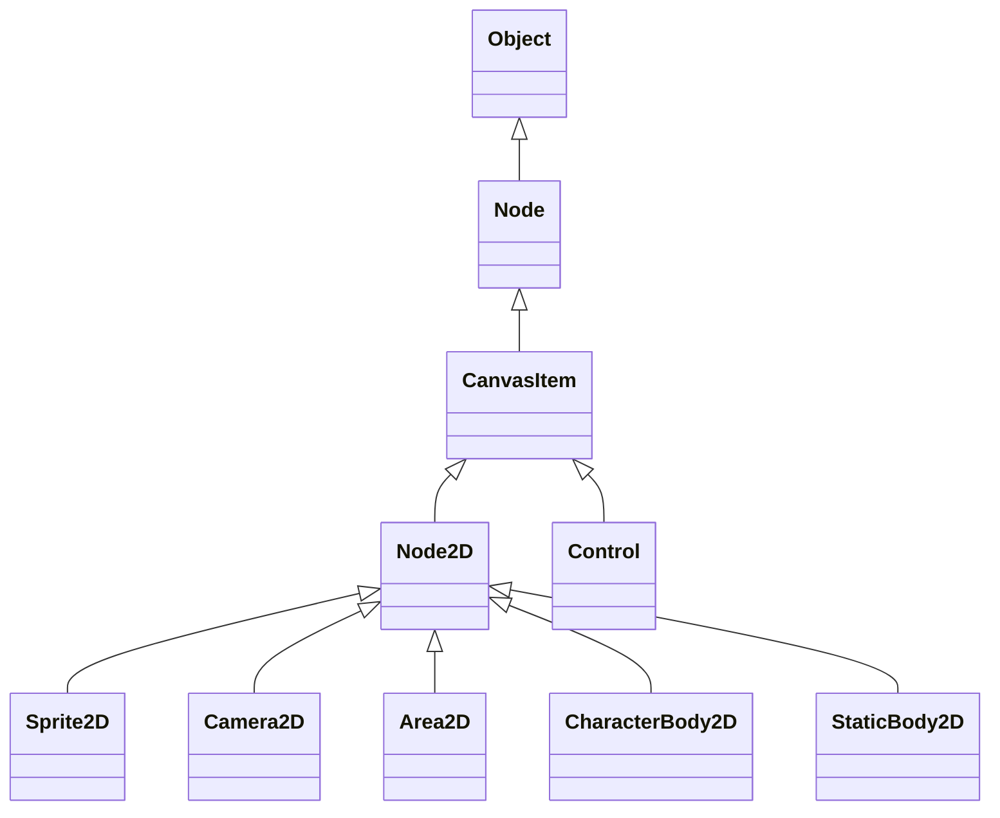

# 06 — شجرة الوراثة Inheritance Tree

## 1. لماذا شجرة الوراثة مهمة؟

شجرة الوراثة تساعدك على فهم ما الذي يرثه كل Node من خصائص وسلوكيات. لكنها لا تخبرك وحدها متى تستخدم هذا Node.

مثال مهم:

- `Sprite2D` يرث من `Node2D`.
- `CharacterBody2D` يرث من `Node2D`.
- لكن `Sprite2D` صورة، و`CharacterBody2D` جسم حركة وتصادم.

إذن الوراثة تعني مشاركة أساس تقني، وليس نفس الاستخدام.

## 2. الشجرة الأساسية

```text
Object
└── Node
    └── CanvasItem
        ├── Node2D
        └── Control
```

## 3. معنى كل مستوى

| المستوى | المعنى |
|---|---|
| `Object` | الأصل العام لكثير من كائنات Godot. |
| `Node` | يضيف مفهوم الوجود داخل Scene Tree. |
| `CanvasItem` | أصل العناصر التي ترسم في 2D أو UI. |
| `Node2D` | أصل أغلب عناصر عالم 2D. |
| `Control` | أصل عناصر واجهة المستخدم. |

## 4. فروع Node2D المبسطة

```text
Node2D
├── Sprite2D
├── AnimatedSprite2D
├── Camera2D
├── Marker2D
├── Area2D
├── CharacterBody2D
├── StaticBody2D
├── RigidBody2D
├── CollisionShape2D
├── RayCast2D
├── Line2D
├── Polygon2D
├── Path2D
├── PathFollow2D
├── Light2D
│   ├── PointLight2D
│   └── DirectionalLight2D
└── TileMapLayer
```

هذه ليست قائمة نهائية لكل شيء، لكنها تكفي للفصل الأول لفهم الفكرة. الفصل الثاني سيتوسع في جميع Nodes المشتقة أو المرتبطة عمليًا بـ `Node2D`.

## 5. مثال: Sprite2D و CharacterBody2D

كلاهما في عالم 2D، لكن دورهما مختلف:

| Node | يرث من | الدور العملي |
|---|---|---|
| `Sprite2D` | `Node2D` | عرض صورة. |
| `CharacterBody2D` | `PhysicsBody2D` ثم `CollisionObject2D` ثم `Node2D` | حركة شخصية وتصادم. |

لذلك لا تقول: “بما أن `Sprite2D` يرث من `Node2D` إذن يصلح للاعب”. اللاعب يحتاج جسمًا مناسبًا للحركة.

## 6. مثال: Node2D و Control

كلاهما يرث من `CanvasItem`، لكن استخدامهما مختلف:

```text
CanvasItem
├── Node2D     ← عالم اللعبة
└── Control    ← واجهة المستخدم
```

| الاستخدام | الصحيح |
|---|---|
| لاعب أو عدو | `Node2D` branch مثل `CharacterBody2D` |
| زر أو قائمة | `Control` branch مثل `Button` أو `Panel` |
| نقاط اللعبة فوق الشاشة | `CanvasLayer` + `Control` |
| صورة داخل العالم | `Sprite2D` |

## 7. قراءة Inherits في التوثيق

عندما تفتح صفحة Class في Godot Docs ستجد سطرًا مثل:

```text
Inherits: CanvasItem < Node < Object
```

هذا يعني أن Class الحالي يرث من `CanvasItem`، و`CanvasItem` يرث من `Node`، و`Node` يرث من `Object`.

اقرأها كالتالي:

```text
CurrentClass → ParentClass → GrandParentClass → Object
```

## 8. الوراثة لا تكفي لاختيار Root Node

مثال:

| Node | هل يرث من Node2D؟ | هل يصلح كـ Root للاعب؟ | السبب |
|---|---:|---:|---|
| `Sprite2D` | نعم | لا غالبًا | صورة فقط. |
| `Node2D` | هو الأصل | لا غالبًا للاعب | لا يوفر فيزياء. |
| `CharacterBody2D` | نعم | نعم غالبًا | مخصص للحركة بالكود. |
| `Area2D` | نعم | لا للاعب، نعم للعملة/Trigger | يكشف ولا يمثل جسم لاعب صلب. |

## 9. Mermaid اختياري للعرض في GitHub



## 10. أخطاء شائعة

| الخطأ | التصحيح |
|---|---|
| الوراثة تعني نفس الاستخدام | الوراثة تعني مشاركة خصائص أساسية فقط. |
| أي شيء يرث من Node2D يصلح للاعب | اللاعب يحتاج Node مناسبًا للحركة والتصادم. |
| Control و Node2D متشابهان لأنهما يرثان CanvasItem | `Control` للواجهة و`Node2D` لعالم اللعبة. |
| حفظ أسماء Nodes دون فهم العلاقات | افهم الدور العملي لكل Node. |

## 11. خلاصة سريعة

استخدم شجرة الوراثة لفهم العلاقة التقنية، لكن استخدم وظيفة المشهد لاختيار النود الصحيح. السؤال الأهم ليس “ممن يرث؟”، بل “ماذا يفعل هذا الشيء في اللعبة؟”.

## 12. مصادر رسمية

- Node class reference: https://docs.godotengine.org/en/stable/classes/class_node.html
- CanvasItem class reference: https://docs.godotengine.org/en/stable/classes/class_canvasitem.html
- Node2D class reference: https://docs.godotengine.org/en/stable/classes/class_node2d.html
