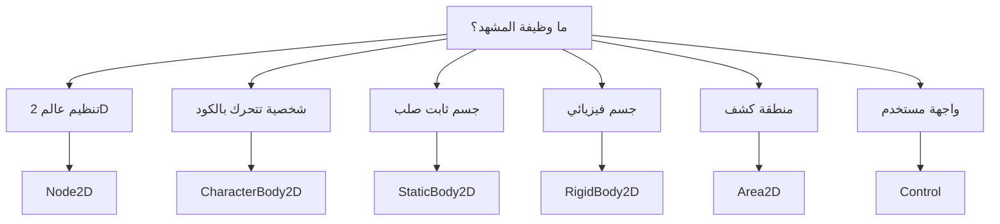

# 07 — كيف تختار Root Node الصحيح؟

## 1. الفكرة الأساسية

Root Node هو أول Node في المشهد. اختيار Root Node الصحيح يعتمد على سؤال واحد:

> ما وظيفة هذا المشهد؟

لا تختار Root Node لأنك تحفظ اسمه، بل لأن وظيفته تناسب الشيء الذي تريد بناءه.

## 2. شجرة قرار سريعة

```text
ماذا تريد أن تمثل هذه Scene؟
│
├── مشهد لعبة 2D كامل أو مجموعة عناصر؟
│   └── Node2D
│
├── لاعب أو عدو يتحرك بالكود؟
│   └── CharacterBody2D
│
├── جسم ثابت يمنع الحركة مثل أرض أو جدار؟
│   └── StaticBody2D
│
├── جسم يتحرك بالفيزياء مثل كرة أو صندوق؟
│   └── RigidBody2D
│
├── منصة أو باب يتحرك يدويًا؟
│   └── AnimatableBody2D
│
├── عملة أو فخ أو Trigger يكشف اللمس فقط؟
│   └── Area2D
│
├── صورة زخرفية بسيطة؟
│   └── Sprite2D أو Node2D
│
└── واجهة مستخدم؟
    └── Control
```

## 3. جدول اختيار سريع

| تريد إنشاء | Root Node المقترح | السبب |
|---|---|---|
| مشهد لعبة عام | `Node2D` | ينظم العالم، اللاعب، الأعداء، الخلفية. |
| لاعب Platformer | `CharacterBody2D` | يحتاج حركة وتصادم واكتشاف أرض. |
| عدو يمشي بالكود | `CharacterBody2D` | يحتاج حركة وتحكم. |
| عملة | `Area2D` | تحتاج كشف لمس اللاعب. |
| فخ ضرر | `Area2D` | يكتشف دخول اللاعب. |
| أرض أو جدار | `StaticBody2D` | جسم ثابت يمنع المرور. |
| منصة متحركة | `AnimatableBody2D` | جسم يتحرك يدويًا ويتفاعل مع اللاعب. |
| صندوق فيزيائي | `RigidBody2D` | يتحرك بالجاذبية والاصطدامات. |
| خلفية أو زخرفة | `Sprite2D` أو `Node2D` | حسب الحاجة للتجميع. |
| واجهة | `Control` | نظام UI. |

## 4. مثال Player

```text
Player (CharacterBody2D)
├── AnimatedSprite2D
├── CollisionShape2D
├── Camera2D
└── Marker2D
```

لماذا `CharacterBody2D`؟

- اللاعب يتحرك بالكود.
- يحتاج تصادمًا.
- يحتاج معرفة هل هو على الأرض.
- يحتاج التعامل مع الجدران والمنحدرات.

## 5. مثال Coin

```text
Coin (Area2D)
├── Sprite2D
└── CollisionShape2D
```

لماذا `Area2D`؟

- العملة لا تمنع اللاعب من المرور.
- نريد فقط معرفة أن اللاعب لمسها.
- عند اللمس نزيد النقاط ونحذف العملة.

## 6. مثال Ground

```text
Ground (StaticBody2D)
├── Sprite2D
└── CollisionShape2D
```

لماذا `StaticBody2D`؟

- الأرض ثابتة.
- اللاعب يجب أن يقف عليها.
- لا نريد الأرض أن تسقط أو تتحرك بالفيزياء.

## 7. مثال Game Scene

```text
Game (Node2D)
├── Level (Node2D)
├── Player (CharacterBody2D)
├── Enemies (Node2D)
├── Pickups (Node2D)
└── UI (CanvasLayer)
    └── Control
```

لماذا `Game` يبدأ بـ `Node2D`؟

لأنه ليس لاعبًا ولا أرضًا ولا Trigger. هو مشهد منظم يحتوي عناصر مختلفة.

## 8. مثال UI

```text
HUD (Control)
├── ScoreLabel (Label)
├── HealthBar (ProgressBar)
└── PauseButton (Button)
```

لماذا `Control`؟

لأن الواجهة تحتاج anchors و containers وتخطيط شاشة، وليس حركة عالم 2D.

## 9. قاعدة ممكن لكن غير مناسب

بعض الاختيارات ممكنة تقنيًا لكنها غير مناسبة عمليًا.

| الاختيار | هل يعمل؟ | لماذا غير مناسب؟ |
|---|---:|---|
| لاعب بـ `Sprite2D` | يظهر بصريًا | لا يملك حركة وتصادم مناسبين. |
| لاعب بـ `StaticBody2D` | قد يتحرك لو غيرت position | ليس مصممًا للشخصيات المتحركة. |
| أرض بـ `Area2D` | تكشف دخول اللاعب | لا تمنع المرور كأرض صلبة. |
| واجهة بـ `Node2D` | قد تظهر | لا تستفيد من نظام UI. |

## 10. Mermaid Decision Tree



## 11. أخطاء شائعة

| الخطأ | الصحيح |
|---|---|
| أبدأ كل شيء بـ `Node2D` | اختر حسب الوظيفة. |
| أبدأ اللاعب بـ `Sprite2D` | استخدم `CharacterBody2D`. |
| أستخدم `Area2D` للأرض | استخدم `StaticBody2D` أو TileMap collision. |
| أستخدم `RigidBody2D` للاعب عادي | استخدمه فقط إذا تريد فيزياء حقيقية. |
| أضع UI داخل `Node2D` مباشرة | استخدم `CanvasLayer` و `Control`. |

## 12. خلاصة سريعة

اختيار Root Node هو قرار تصميمي. اسأل: هل هذا الشيء يتحرك؟ هل يمنع الحركة؟ هل يكشف فقط؟ هل هو واجهة؟ الإجابة تحدد Root الصحيح.

## 13. مصادر رسمية

- Node2D class reference: https://docs.godotengine.org/en/stable/classes/class_node2d.html
- CharacterBody2D class reference: https://docs.godotengine.org/en/stable/classes/class_characterbody2d.html
- StaticBody2D class reference: https://docs.godotengine.org/en/stable/classes/class_staticbody2d.html
- RigidBody2D class reference: https://docs.godotengine.org/en/stable/classes/class_rigidbody2d.html
- Area2D class reference: https://docs.godotengine.org/en/stable/classes/class_area2d.html
- Control class reference: https://docs.godotengine.org/en/stable/classes/class_control.html
